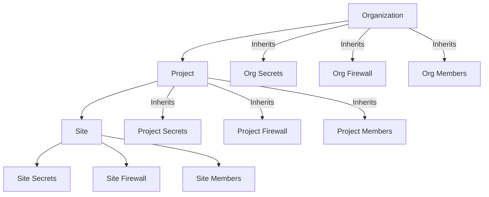

LibOps is a platform designed to simplify the deployment and management of Docker Compose applications in the cloud. It provides a structured, hierarchical approach to infrastructure management, allowing you to focus on your applications rather than the underlying server operations.

## Architecture

LibOps uses a hierarchical model to organize resources and permissions. This structure ensures that policies, secrets, and access controls are applied consistently and efficiently.

### Hierarchy Levels

1.  **Organization**: The top-level entity. Represents your institution or company. Settings, secrets, and members applied here cascade down to all projects and sites.
2.  **Project**: Represents a specific application or service (e.g., "Institutional Repository", "Library Website"). Projects group related sites (environments) together.
3.  **Site**: A running instance of a project (e.g., "Production", "Staging", "Dev"). This is where your Docker Compose workloads actually run.

## Core Concepts

### Secrets Management

Secrets are encrypted environment variables used by your applications. LibOps uses a cascading inheritance model for secrets:

*   **Organization Secrets**: Available to every site in the organization.
*   **Project Secrets**: Available to every site in the project. Overrides organization secrets of the same name.
*   **Site Secrets**: Available only to the specific site. Overrides project and organization secrets of the same name.

This allows you to set global defaults (like a registry credential) while overriding specific values (like a database password) for production vs. staging.

### Firewall & Security

Security is managed via allow-list based firewall rules. Like secrets, these rules cascade:

*   **Organization Rules**: Apply to all sites. (e.g., Allow campus VPN IP range)
*   **Project Rules**: Apply to all sites in the project.
*   **Site Rules**: Apply to a specific site. (e.g., Allow public access to Production only)

### Members & Access Control

Role-Based Access Control (RBAC) allows you to grant granular permissions. Users can be added at any level (Organization, Project, or Site) and inherit access to child resources.

*   **Owners**: Full control, including billing and member management.
*   **Developers**: Can deploy and manage resources but cannot delete the parent entity or manage members.
*   **Viewers**: Read-only access.

## Getting Started

To start using LibOps, you will typically follow this workflow:

1.  **Create an Account**: Sign up and create your Organization.
2.  **Install the CLI**: The `sitectl` CLI is the primary tool for interaction.
    <Card title="Install CLI" icon="terminal" href="/cli/introduction">
      Get set up with sitectl
    </Card>
3.  **Create a Project**: Define your application.
4.  **Deploy a Site**: Launch your Docker Compose application.

## Authentication

LibOps uses API Keys for authentication.

*   **CLI**: Run `sitectl login` to authenticate interactively.
*   **API**: Use the `Authorization: Bearer <token>` header.

## Best Practices

*   **Use Hierarchy**: Define common secrets and firewall rules at the Organization level to reduce duplication.
*   **Separate Environments**: Use distinct Sites for Development, Staging, and Production within the same Project.
*   **Least Privilege**: Grant user access only at the level they need. If a user only works on one project, add them to that Project, not the Organization.

## Troubleshooting

If you encounter issues:

*   **CLI Logs**: Use `sitectl compose logs` to view application logs.
*   **Site Status**: Check the Dashboard or use `sitectl get site` to view the infrastructure status.
*   **Support**: Contact our support team if you need assistance with the platform infrastructure.