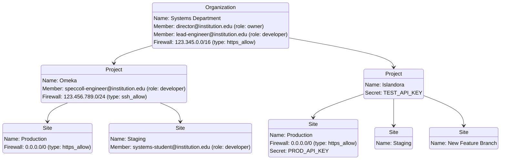

## What is LibOps?

LibOps is a platform for deploying and managing Docker Compose applications in the cloud. We handle the infrastructure complexity so you can focus on building great applications.

### Key Features


<CardGroup cols={2}>
  <Card
    title="Docker Compose"
    icon="docker"
    href="/templates/islandora"
    color="#1D63ED"
  >The same compose project you run locally runs in the cloud</Card>

  <Card
    title="Google Cloud"
    icon="/images/gcloud.png"
    href="/templates/ojs"
  >Docker workloads run on your project's isolated VM using Google's Container-Optimized Operating System</Card>

  <Card
    title="Branch Sites"
    icon="github"
    href="/templates/ojs"
    color="#000000"
  >Pushing to GitHub triggers deployments. GitHub PRs create new sites to allow for review.</Card>

  <Card
    title="Team Collaboration"
    icon="people-group"
    href="/templates/ojs"
  >Role-based access control for organizations, projects, and sites</Card>

  <Card
    title="Automated updates"
    icon="https://docs.renovatebot.com/assets/images/logo.png"
    href="/templates/ojs"
  >Leverage mend.io's Renovate bot to keep your project dependencies up-to-date</Card>

  <Card
    title="Secrets Management"
    icon="vault"
    href="/templates/ojs"
  >Organization-wide or project/site specific secrets for your site workloads</Card>

  <Card
    title="Firewall Control"
    icon="arrow-down-up-lock"
    href="/templates/ojs"
  >Organization-wide or projects/site specific firewall for your sites</Card>

  <Card
    title="Web, CLI, & API"
    icon="terminal"
    href="/templates/ojs"
  >Full-featured Dashboard, CLI, and REST API for automation</Card>

</CardGroup>


## How It Works

LibOps organizes your infrastructure hierarchically:


```mermaid
stateDiagram-v2
    state "Organization" as org
    state "Name: Systems Department" as org
    state "Member: director@institution.edu (role: owner)" as org
    state "Member: lead-engineer@institution.edu (role: developer)" as org
    state "Firewall: 123.345.0.0/16 (type: https_allow)" as org

    org --> omeka
    org --> islandora

    state "Project" as omeka
    state "Name: Omeka" as omeka
    state "Member: speccoll-engineer@institution.edu (role: developer)" as omeka
    state "Firewall: 123.456.789.0/24 (type: ssh_allow)" as omeka

    omeka --> omeka_prod
    omeka --> omeka_stage

    state "Site" as omeka_prod
    state "Name: Production" as omeka_prod
    state "Firewall: 0.0.0.0/0 (type: https_allow)" as omeka_prod

    state "Site" as omeka_stage
    state "Name: Staging" as omeka_stage
    state "Member: systems-student@institution.edu (role: developer)" as omeka_stage


    state "Project" as islandora
    state "Name: Islandora" as islandora
    state "Secret: TEST_API_KEY" as islandora

    islandora --> isle_prod
    islandora --> isle_stage
    islandora --> isle_feature_1

    state "Site" as isle_prod
    state "Name: Production" as isle_prod
    state "Firewall: 0.0.0.0/0 (type: https_allow)" as isle_prod
    state "Secret: PROD_API_KEY" as isle_prod


    state "Site" as isle_stage
    state "Name: Staging" as isle_stage


    state "Site" as isle_feature_1
    state "Name: New Feature Branch" as isle_feature_1
```

### Organizations

An organization allows assigning members, secrets, and firewall rules for all sites in all projects.

In the above example, the director is a member of the organization, so they have access to all projects and sites in that organization.
The lead developer also has developer access to all projects in the organization. The difference between an owner and a developer role is an owner can create new projects and members in an organization.

There's also a firewall rule to allow accessing all sites in all projects from the campus IP range.

### Projects

A project represents a docker compose project. It consists of a GitHub Repository and a Google Cloud Project.

In the above example, there are two projects: Omeka and Islandora.

Omeka adds a developer from the Special Collections department to allow pushing code to all sites in that project.
There's also a firewall rule to allow SSH access from a specific subnet on-campus to all sites in the Omeka project.

Islandora sets a default secret all site workloads in that project will have access to. In this example, an API key is set the site's code uses to authenticate to an API.

### Sites

A site represents a running instance of a project.

In the above example, Omeka has two sites: production and staging. There is a student worker added to the staging site to allow them to push code to that site.

Islandora has three sites: production, staging, and a new feature branch site.
Islandora's production site creates a new secret for the production API key. If this is named the same as the project-level secret, it will allow the production credentials to only be used on the production site, and all other sites use the test credentials.

For both sites, production is open to the world-wide web. Since the org-level firewall is in place, the other non-production sites will only be available from on-campus.


## Ready-to-Deploy Templates

Get started quickly with our production-ready application templates:

<CardGroup cols={2}>
  <Card
    title="Islandora (ISLE)"
    icon="building-columns"
    href="/templates/islandora"
  >
    Launch a complete digital repository for institutional collections
  </Card>
  <Card
    title="Open Journal Systems (OJS)"
    icon="book-open"
    href="/templates/ojs"
  >
    Deploy academic journal publishing platform with automated setup
  </Card>

</CardGroup>

<Note>
More templates coming soon: Omeka, Drupal, WordPress, and other popular GLAM Open-Source software.
</Note>

## Quick Start

<CardGroup cols={2}>
  <Card
    title="Deploy Your First Site"
    icon="rocket"
    href="/quickstart"
  >
    Get started in minutes with our quickstart guide
  </Card>
  <Card
    title="Install sitectl CLI"
    icon="terminal"
    href="/cli/introduction"
  >
    Install and configure the LibOps CLI tool
  </Card>
  <Card
    title="API Reference"
    icon="code"
    href="/api/reference/introduction"
  >
    Explore the complete API documentation
  </Card>
  <Card
    title="Dashboard"
    icon="gauge"
    href="https://dash.libops.io"
  >
    Manage your infrastructure in the web dashboard
  </Card>
</CardGroup>

## Choose Your Tool

<CardGroup cols={2}>
  <Card
    title="sitectl CLI"
    icon="terminal"
    href="/cli/introduction"
  >
    **For developers and automation**

    - Manage local and remote Docker Compose sites
    - Context-aware configuration
    - SSH port forwarding to remote services
    - Full API access from the command line

    ```bash
    sitectl compose up
    sitectl port-forward 5432:postgres:5432
    ```
  </Card>

  <Card
    title="REST API"
    icon="code"
    href="/api/reference/introduction"
  >
    **For integrations and workflows**

    - Complete programmatic access
    - Create infrastructure as code
    - Integrate with CI/CD pipelines
    - Build custom tooling

    ```bash
    curl -X POST https://api.libops.io/v1/sites \
      -H "Authorization: Bearer $TOKEN"
    ```
  </Card>
</CardGroup>

## Core Concepts

<CardGroup cols={2}>
  <Card
    title="Organizations & Projects"
    icon="building"
    href="/cli/organizations"
  >
    Organize your infrastructure hierarchically with organizations containing projects and sites
  </Card>

  <Card
    title="Secrets Management"
    icon="key"
    href="/cli/secrets"
  >
    Store encrypted credentials at organization, project, or site level with automatic inheritance
  </Card>

  <Card
    title="Firewall Rules"
    icon="shield"
    href="/cli/firewall"
  >
    Control access with IP-based firewall rules that cascade through your hierarchy
  </Card>

  <Card
    title="Team Management"
    icon="users"
    href="/cli/members"
  >
    Add team members with role-based permissions at any level of your infrastructure
  </Card>
</CardGroup>

## Common Workflows

### Deploy a Production Application

```bash
# Authenticate with LibOps
sitectl login

# Create infrastructure
ORG_ID=$(sitectl create organization --name "ACME Corp" --format json | jq -r '.id')
PROJECT_ID=$(sitectl create project --organization-id $ORG_ID --name "Production" --format json | jq -r '.id')
SITE_ID=$(sitectl create site --project-id $PROJECT_ID --name "web-app" --domain "app.acme.com" --format json | jq -r '.id')

# Add secrets
sitectl create secrets --site-id $SITE_ID --key "DATABASE_URL" --value "postgresql://..."
sitectl create secrets --site-id $SITE_ID --key "API_KEY" --value "sk_live_..."

# Add firewall rules
sitectl create firewall --site-id $SITE_ID --cidr "203.0.113.0/24" --description "Office network"

# Add team members
sitectl create members --site-id $SITE_ID --email "admin@acme.com" --role "admin"
```

### Manage with the API

```bash
# Create a site via API
curl -X POST https://api.libops.io/v1/sites \
  -H "Authorization: Bearer $TOKEN" \
  -H "Content-Type: application/json" \
  -d '{
    "project_id": "proj_xyz789",
    "name": "api-gateway",
    "domain": "api.acme.com"
  }'

# Add a secret via API
curl -X POST https://api.libops.io/v1/secrets \
  -H "Authorization: Bearer $TOKEN" \
  -H "Content-Type: application/json" \
  -d '{
    "site_id": "site_123abc",
    "key": "DATABASE_URL",
    "value": "postgresql://..."
  }'
```

### Access Remote Services (CLI)

```bash
# Forward remote database to local port
sitectl port-forward 5432:postgres:5432

# Now connect locally
psql -h localhost -p 5432 -U myuser mydb
```

## Platform Features

<AccordionGroup>
  <Accordion title="Multi-Environment Management">
    Manage development, staging, and production environments with separate projects or sites. Use the same Docker Compose files across all environments with environment-specific secrets and configuration.
  </Accordion>

  <Accordion title="Secrets Hierarchy">
    Create secrets at organization level for company-wide credentials, project level for application-wide config, or site level for deployment-specific values. Secrets automatically inherit down the hierarchy.
  </Accordion>

  <Accordion title="Access Control">
    Add team members at any level with specific roles (admin, developer, viewer). Members inherit access to child resources. Combine with firewall rules for defense-in-depth security.
  </Accordion>

  <Accordion title="Docker Compose Integration">
    Deploy any Docker Compose application without modification. The sitectl CLI provides seamless management of both local and remote Docker environments, with SSH support for remote servers.
  </Accordion>

  <Accordion title="Infrastructure as Code">
    Fully automate your infrastructure with the REST API. Create organizations, projects, sites, secrets, and firewall rules programmatically. Perfect for CI/CD pipelines.
  </Accordion>
</AccordionGroup>

## Get Help

<CardGroup cols={2}>
  <Card
    title="CLI Documentation"
    icon="terminal"
    href="/cli/introduction"
  >
    Complete reference for sitectl commands and configuration
  </Card>

  <Card
    title="API Documentation"
    icon="book"
    href="/api/reference/introduction"
  >
    REST API endpoints for all LibOps resources
  </Card>

  <Card
    title="Support"
    icon="life-ring"
    href="/support"
  >
    Get help with LibOps via issues, discussions, Slack, or email
  </Card>

  <Card
    title="GitHub"
    icon="github"
    href="https://github.com/libops"
  >
    View source code and examples
  </Card>
</CardGroup>
